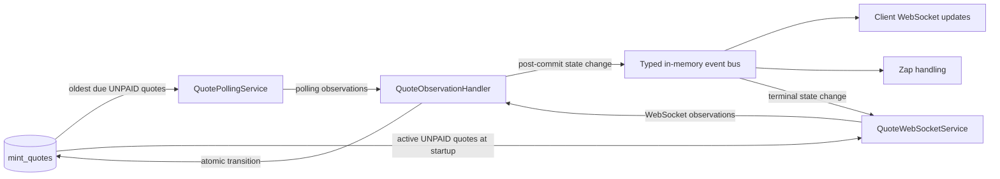

# Mint quote monitoring implementation map

Status: implementation in progress; roadmap Slice 1 complete.

This map implements [ADR 0001](adr/0001-centralize-mint-quote-observations.md). It replaces the monolithic `DefaultMintQuoteMonitor` with separate polling and WebSocket modules feeding one Quote Observation handler. The database remains the source of truth; process-local events notify reactions only after a committed state change.

## Goals

- Keep both HTTP polling and WebSocket quote subscriptions.
- Give polling, WebSocket transport, state reconciliation, and reactions distinct ownership.
- Make polling fair with `last_polled_at`, without persisted retry schedules.
- Make polling/WebSocket races idempotent through atomic state transitions.
- Emit one typed event for each persisted Quote State Change.
- Remove monitoring lifecycle and subscription forwarding from `CommunicatorService` and the LNURL controller.

## Explicit non-goals

- Multiple application instances or cross-process event delivery.
- Durable or exactly-once event delivery. Reactions remain best-effort.
- Ordering observations by the mint's optional `updated_at` field.
- Publishing raw mint payloads on the application event bus.
- Retaining persistent per-mint circuit breakers or per-quote reconciliation schedules.

## Target flow



Incoming mint data is a **Quote Observation**. Only the handler can turn it into a persisted **Quote State Change**. The application event bus carries the latter, never the former.

## Module seams

### QuotePollingService

External interface:

```ts
interface QuotePollingService {
  start(): Promise<void>;
  stop(): Promise<void>;
}
```

Responsibilities:

- Run one polling round immediately on startup and schedule subsequent rounds without overlap.
- Take a bounded batch of due Pollable Mint Quotes ordered by `last_polled_at`, with never-polled quotes first.
- Mark selected quotes as polled before starting remote requests, including quotes whose requests later fail.
- Group selected quotes by normalized mint URL and respect the existing per-mint request budget and request timeout.
- Use NUT-29 batching when supported and individual quote checks as the fallback. Batching is an internal transport optimization and still produces one observation per quote.
- Forward `found` and authoritative `not_found` results to the handler with the HTTP request start time.
- Log transport failures and malformed responses without asking the handler to change quote state.
- Abort in-flight work on shutdown.

The module does not subscribe to quote-creation events. Newly created rows become visible through the database queue on the next round.

### QuoteWebSocketService

External interface:

```ts
interface QuoteWebSocketService {
  start(): Promise<void>;
  stop(): Promise<void>;
}
```

Responsibilities:

- Reuse the existing WebSocket connection, batching, reconnect, and resubscription implementation.
- At startup, subscribe to `UNPAID` quotes whose local expiry is still in the future.
- Listen for `mintQuote.created` and subscribe newly persisted, unexpired quotes.
- Forward valid WebSocket payloads to the handler.
- Listen for terminal `mintQuote.stateChanged` events and remove the associated subscription.
- Never write quote business state or `last_polled_at`.
- Close sockets and remove event listeners on shutdown.

Expired `UNPAID` quotes are handled only by polling because a WebSocket `UNPAID` payload is not authoritative evidence of expiry.

### QuoteObservationHandler

External interface:

```ts
interface QuoteObservationHandler {
  handle(
    observation: QuoteObservation,
  ): Promise<QuoteStateChange | undefined>;
}

type QuoteStateChange = {
  quote: MintQuote;
  source: "polling" | "websocket";
};
```

Observation shape:

```ts
type QuoteObservation =
  | {
      source: "polling";
      mintQuoteId: number;
      requestStartedAt: Date;
      result:
        | { kind: "found"; payload: MintQuotePayload }
        | { kind: "not_found" };
    }
  | {
      source: "websocket";
      mintQuoteId: number;
      payload: MintQuotePayload;
    };
```

Responsibilities:

- Load the current Mint Quote by its internal database ID.
- Verify that the remote quote ID matches the persisted quote ID.
- Translate the observation into an allowed state transition.
- Apply the transition with one atomic conditional update.
- Set `paid_at` on the first transition to `PAID`, or when moving directly to `ISSUED`; preserve it on `PAID -> ISSUED`.
- Return and emit the same `QuoteStateChange` only when the conditional update returns a changed row.
- Treat duplicate, regressive, mismatched, and non-authoritative observations as no-ops.

The handler owns business-state rules but not polling cadence, socket lifecycle, transport retry, or downstream reactions.

### MintQuoteMonitoringStore

This is the persistence seam implemented by both PostgreSQL and SQLite adapters. Its intended interface is small and behavior-oriented:

```ts
interface MintQuoteMonitoringStore {
  takeDueForPolling(input: {
    dueBefore: Date;
    polledAt: Date;
    limit: number;
  }): Promise<MintQuote[]>;

  getActiveUnpaidQuotes(now: Date): Promise<MintQuote[]>;
  getById(id: number): Promise<MintQuote | undefined>;

  transitionState(input: {
    id: number;
    from: readonly MintQuoteState[];
    to: Extract<MintQuoteState, "PAID" | "ISSUED" | "EXPIRED">;
    paidAt?: Date;
  }): Promise<MintQuote | undefined>;
}
```

`takeDueForPolling` selects and marks a bounded queue batch as one store operation. Although the deployment assumes one process, keeping selection and marking together prevents accidental overlap and keeps scheduling rules out of callers.

## State-transition rules

| Observation | Source | Current local state | Result | Emit state change |
| --- | --- | --- | --- | --- |
| `PAID` | Polling or WebSocket | `UNPAID`, `EXPIRED` | `PAID` | Yes |
| `ISSUED` | Polling or WebSocket | `UNPAID`, `EXPIRED`, `PAID` | `ISSUED` | Yes |
| `UNPAID`, request started at or after local expiry | Polling | `UNPAID` | `EXPIRED` | Yes |
| `UNPAID`, request started before local expiry | Polling | Any | No change | No |
| `UNPAID` | WebSocket | Any | No change | No |
| `PENDING` | Polling or WebSocket | Any | No change | No |
| `not_found` | Polling | `UNPAID` | `EXPIRED` | Yes |
| Duplicate target state | Either | Same as target | No change | No |
| Regressive terminal state | Either | Terminal state | No change | No |
| Payload quote ID mismatch | Either | Any | Ignore | No |

An observation already in flight may correct `EXPIRED` to `PAID` or `ISSUED`. Once a quote is terminal and no observation remains in flight, neither transport continues monitoring it.

## Polling queue

Add a nullable `last_polled_at` column to `mint_quotes`:

- PostgreSQL: `TIMESTAMPTZ`
- SQLite: `TEXT`, encoded consistently with the repository's existing date columns
- `NULL` means the quote has never been polled and sorts first.

Add an index equivalent to:

```sql
CREATE INDEX idx_mint_quotes_polling
ON mint_quotes (state, last_polled_at, id);
```

A quote is due when:

```text
state = UNPAID
and (last_polled_at is null or last_polled_at <= now - poll interval)
```

The queue uses `id` as the deterministic tie-breaker. `last_polled_at` is operational metadata: changing it does not alter `paid_at`, does not count as a Quote State Change, and does not emit an event. WebSocket traffic does not postpone HTTP fallback polling.

`last_polled_at` remains private to the persistence adapter and polling queue. It is not added to the `MintQuote` domain model or exposed in application events.

Applied migrations must not be rewritten. Introduce the column and index in a new migration. Keep the old retry and reconciliation tables during cutover; remove them in a later cleanup migration after no production code reads them.

## Event contracts

Replace the single `quotePaid` event with typed domain events:

```ts
type Events = {
  "mintQuote.created": MintQuote;
  "mintQuote.stateChanged": QuoteStateChange;
};
```

Event rules:

- `mintQuote.created` is emitted after the quote insert succeeds.
- `mintQuote.stateChanged` is emitted after the state update commits.
- Handlers may be synchronous or asynchronous; the bus must catch and log both synchronous throws and rejected promises.
- One failing listener must not prevent other listeners from running or roll back persisted state.
- `on` returns an unsubscribe function so the WebSocket module can clean up its listeners.
- Delivery is process-local, best-effort, and not replayed after restart.

Existing reactions move behind `mintQuote.stateChanged` listeners:

- Update connected clients when the new state is `PAID`, preserving current behavior.
- Handle a zap when the new state is `PAID`, preserving current behavior and error isolation.
- Remove mint WebSocket subscriptions for `PAID`, `ISSUED`, and `EXPIRED`.

## Lifecycle and creation flow

Application startup order:

1. Initialize repositories and the observation handler.
2. Register event listeners.
3. Start the WebSocket module so it restores active subscriptions.
4. Start the polling module; it runs an immediate round.
5. Begin accepting HTTP and WebSocket clients.

Quote creation becomes:

1. Request a quote from the mint through `CommunicatorService`.
2. Persist it through `MintQuoteRepository.create`.
3. Emit `mintQuote.created`.
4. Return the payment request.

The controller no longer calls `createQuoteSubscription`, and `CommunicatorService` no longer owns monitoring startup or shutdown.

Shutdown stops polling before WebSockets, aborts in-flight HTTP requests, closes mint sockets, and unregisters listeners.

## File-by-file map

### Add

- `packages/server/src/domain/mintQuoteMonitoring/QuoteObservation.ts`: transport-neutral observation types.
- `packages/server/src/domain/mintQuoteMonitoring/QuoteObservationHandler.ts`: reconciliation, atomic transition, and post-commit publication.
- `packages/server/src/domain/mintQuoteMonitoring/QuoteObservationHandler.test.ts`: transition-table and race tests.
- `packages/server/src/domain/mintQuoteMonitoring/QuotePollingService.ts`: queue scheduling and HTTP observation production.
- `packages/server/src/domain/mintQuoteMonitoring/QuotePollingService.test.ts`: queue, fairness, lifecycle, and forwarding tests.
- `packages/server/src/domain/mintQuoteMonitoring/QuoteWebSocketService.ts`: subscription lifecycle and WebSocket observation production.
- `packages/server/src/domain/mintQuoteMonitoring/QuoteWebSocketService.test.ts`: restore, event subscription, reconnect, forwarding, and cleanup tests.
- `packages/server/src/domain/mintQuoteMonitoring/MintQuoteMonitoringStore.ts`: persistence interface shared by the three modules.

### Refactor and retain

- `packages/server/src/domain/mintQuoteMonitor/MintQuoteClient.ts`: retain HTTP validation, NUT-29 detection, batching, timeout, and request-budget behavior; consume it only from the polling module.
- `packages/server/src/domain/mintQuoteMonitor/WebSocketQuoteTransport.ts`: retain wire-level connection, subscription batching, reconnect, and payload validation as an internal adapter used by the WebSocket module.
- Their focused transport tests remain, but tests that assert monolithic monitor scheduling move to the new module interfaces.

The transport files may move under `mintQuoteMonitoring/` after behavior is stable. Moving them is not required for the behavioral cutover and should not be mixed into the first implementation step.

### Modify

- `packages/server/src/infrastructure/db/sqliteMintQuoteRepository.ts`: map `last_polled_at` and implement the new store operations.
- `packages/server/src/infrastructure/db/postgresMintQuoteRepository.ts`: mirror the SQLite behavior and atomic transitions.
- `packages/server/src/infrastructure/db/repositoryFactory.ts`: expose `MintQuoteMonitoringStore` instead of `MintQuoteMonitorStore`.
- `packages/server/src/migrations.ts`: add the new column and polling index in a new migration.
- `packages/server/src/events.ts`: add typed created/state-changed events, async error isolation, and unsubscribe support.
- `packages/server/src/controller/lnurlController.ts`: emit `mintQuote.created` after persistence and remove explicit subscription creation.
- `packages/server/src/domain/communicator/CommunicatorService.ts`: remove the monitor dependency and monitoring lifecycle forwarding.
- `packages/server/src/config.ts`: construct the handler and both transport modules, register reactions, and expose application lifecycle methods.
- `packages/server/src/index.ts`: start monitoring directly through application lifecycle rather than through `CommunicatorService`.
- `packages/server/src/config/env.ts`, `packages/server/src/config/env.test.ts`, `packages/server/src/config/index.ts`, and `example.env`: keep poll interval, request timeout, request budget, and WebSocket reconnect settings; remove retry schedules and jitter settings.
- `docs/deploy.md`: replace the existing circuit/reconciliation description with the queue, WebSocket fallback, and single-instance event semantics.

### Remove after cutover

- `packages/server/src/domain/mintQuoteMonitor/MintQuoteMonitor.ts`
- `packages/server/src/domain/mintQuoteMonitor/MintQuoteMonitor.test.ts`
- `packages/server/src/domain/mintQuoteMonitor/MintQuoteMonitorStore.ts`
- Startup batch reconciliation, per-quote expiry timers, in-memory mint sessions, persistent circuit state, and related configuration.

The old `mint_quote_mint_retries` and `mint_quote_reconciliation` tables are removed only by the later cleanup migration.

## Delivery roadmap

Implementation is organized as end-to-end vertical slices rather than persistence, domain, and transport layers. See the [vertical-slice roadmap](mint-quote-monitoring-roadmap.md) for scope, ordering, rollout constraints, tests, and exit conditions.

1. Centralize observation decisions and post-commit state-change events while the existing monitor continues supplying observations.
2. Cut the mint WebSocket path over to its standalone module.
3. Cut HTTP polling over to the oldest-due queue and remove the monolithic monitor.
4. After a production soak, retire obsolete retry storage and operational controls.

Each slice leaves the application deployable and puts a real production path through every new seam it introduces. Tests move to the new owning module in the same slice; obsolete monolith tests are deleted only when their behavior has moved.

## Verification map

### Observation handler

- Ignores mismatched quote IDs.
- Treats `UNPAID` and `PENDING` as no-ops before expiry.
- Expires only from an authoritative polling observation.
- Does not expire from a request that started before expiry but completed afterward.
- Persists `PAID` and emits exactly one event for duplicate or racing HTTP/WebSocket observations.
- Allows an in-flight `PAID` or `ISSUED` observation to correct `EXPIRED`.
- Allows `PAID -> ISSUED` without overwriting the original `paid_at`.
- Never regresses a terminal state.
- Publishes only after the store reports a committed transition.

### Polling module

- Selects never-polled and oldest-due quotes first with deterministic ordering.
- Advances `last_polled_at` even when a mint is unavailable.
- Does not select terminal or not-yet-due quotes.
- Never overlaps polling rounds.
- Does not let one slow or unavailable mint prevent other mints from being checked.
- Maps individual and batch responses to one observation per quote.
- Aborts requests and timers on shutdown.

### WebSocket module

- Restores only active, unexpired `UNPAID` subscriptions.
- Subscribes after `mintQuote.created`.
- Forwards payloads without writing state itself.
- Retains reconnect and batched subscription behavior.
- Unsubscribes on terminal state-change events.
- Stops sockets and removes application event listeners cleanly.

### Persistence and integration

- PostgreSQL and SQLite implement identical queue ordering and transition behavior.
- A polling/WebSocket race changes the row and emits the state-change event once.
- Restart restores subscriptions from the database and immediately resumes polling due quotes.
- Event listener failure does not affect persisted quote state or other listeners.
- The LNURL response succeeds after quote persistence even if a best-effort event listener fails.

## Completion criteria

- No code path constructs or calls `DefaultMintQuoteMonitor`.
- No controller or `CommunicatorService` method explicitly starts, stops, or registers quote monitoring.
- Polling and WebSocket modules share only the observation handler and domain event contracts.
- Quote business state is written only through the observation handler's persistence seam.
- `last_polled_at` is written only by the polling queue operation.
- All retained behaviors are covered through the three new module interfaces and both database adapters.
- The single-instance and best-effort event assumptions are visible in deployment documentation.
