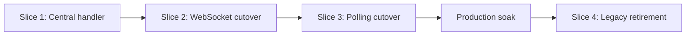

# Mint quote monitoring vertical-slice roadmap

Status: Slices 1–3 implemented; Slice 4 gated on production soak.

This roadmap delivers the [mint quote monitoring implementation map](mint-quote-monitoring-implementation-map.md) and [ADR 0001](adr/0001-centralize-mint-quote-observations.md) as independently deployable vertical slices. Each slice crosses transport, domain, persistence, events, application wiring, and tests as needed to put a real production path through the new design.

## Delivery rules

- Each slice must leave the server deployable with one owner for each observation channel.
- New interfaces are introduced only when production code starts using them in that slice.
- A state-changing behavior and its tests move together; the old test is then deleted rather than retained as a second specification.
- Database changes remain backward compatible until the post-cutover cleanup slice.
- No slice publishes raw mint payloads on the application event bus.
- No slice relies on the mint's optional `updated_at`.
- Process-local event delivery continues to assume one application instance.

## Roadmap

| Slice | Outcome | Depends on | Relative size |
| --- | --- | --- | --- |
| 1. One observation decision path (implemented) | Existing transports reconcile state through the centralized handler and emit post-commit events | None | Large |
| 2. Standalone WebSocket path (implemented) | Mint WebSocket lifecycle and observations no longer belong to the monitor | Slice 1 | Medium |
| 3. Oldest-first polling path (implemented) | Database-backed polling replaces the remaining monitor and removes it | Slice 2 | Large |
| 4. Retire legacy operations | Obsolete retry storage and configuration are removed after the new paths soak | Slice 3 plus production validation | Small |



Slices merge in order. Transport-focused implementation work may be prepared separately, but it should not merge ahead of the slice that gives it a production caller.

## Slice 1: One observation decision path

### Outcome

The existing `DefaultMintQuoteMonitor` continues to own polling schedules and mint WebSocket subscriptions, but it no longer decides or writes quote business state. Both of its observation paths call `QuoteObservationHandler`, which performs an atomic transition and emits `mintQuote.stateChanged` after commit.

Production path at the end of the slice:

```text
Current HTTP/WebSocket monitor
  -> QuoteObservationHandler
  -> PostgreSQL or SQLite transition
  -> mintQuote.stateChanged
  -> client notification and zap reactions
```

### Included work

- Add `QuoteObservation`, `QuoteStateChange`, and `QuoteObservationHandler`.
- Add the handler's lookup and conditional-transition persistence seam to both database adapters while retaining `MintQuoteMonitorStore` for the monitor's temporary scheduling needs.
- Encode the agreed transition table, expiry authority, payload identity validation, correction rules, and `paid_at` preservation in the handler.
- Return `QuoteStateChange | undefined` from `handle`; emit the returned change after the database commit.
- Replace `quotePaid` with `mintQuote.stateChanged` and move client notification and zap handling to listeners that filter for `PAID`.
- Make the event bus catch synchronous listener failures and rejected promises, continue dispatching to other listeners, and return unsubscribe functions.
- Refactor the current monitor to produce observations and use the handler result for terminal cleanup. It retains scheduling, retry, and transport lifecycle only.
- Keep current HTTP and WebSocket request behavior unchanged.

### Tests that move in this slice

- Payload quote-ID mismatch is ignored.
- `PAID`, `ISSUED`, `EXPIRED`, correction, duplicate, and regression rules.
- HTTP expiry authority, including a request that crosses expiry while in flight.
- Polling/WebSocket terminal races produce one committed transition and one event.
- `paid_at` is set once and preserved by `PAID -> ISSUED`.
- Events are post-commit, and one failed async listener does not affect state or other listeners.
- Both SQLite and PostgreSQL enforce the same conditional transitions.

State-transition assertions move out of `MintQuoteMonitor.test.ts`. Its scheduling, retry, startup, and transport-orchestration tests remain until their owning slices arrive.

### Exit conditions

- All quote business-state writes caused by mint observations pass through `QuoteObservationHandler`.
- `DefaultMintQuoteMonitor` contains no state-transition table or downstream `onPaid` callback.
- `quotePaid` has no publishers or listeners.
- Existing polling and mint WebSocket behavior still run in production through the new handler.
- The full server test suite passes on both database adapters.

### Rollout and rollback

This slice adds no destructive migration and keeps the existing monitor lifecycle. Rolling back restores the old in-process decision path without a data conversion.

## Slice 2: Standalone WebSocket path

### Outcome

`QuoteWebSocketService` exclusively owns mint WebSocket subscription lifecycle and forwards payloads to the handler. `DefaultMintQuoteMonitor` remains temporarily as the HTTP polling implementation, with all WebSocket responsibilities removed.

Production path at the end of the slice:

```text
mintQuote.created or startup database recovery
  -> QuoteWebSocketService
  -> WebSocketQuoteTransport
  -> QuoteObservationHandler
  -> database and mintQuote.stateChanged
  -> terminal unsubscribe
```

### Included work

- Add `QuoteWebSocketService` with `start` and `stop` as its external interface.
- Reuse `WebSocketQuoteTransport` for wire connections, batched subscriptions, reconnects, resubscriptions, request budgeting, and payload validation.
- Add `getActiveUnpaidQuotes(now)` to the monitoring persistence seam.
- Restore unexpired `UNPAID` subscriptions at startup.
- Introduce `mintQuote.created`, emitted by the LNURL flow only after quote persistence.
- Subscribe newly created, unexpired quotes and unsubscribe on terminal `mintQuote.stateChanged` events.
- Start and stop the WebSocket module from application composition.
- Remove `ActiveQuoteTransport`, WebSocket callbacks, expiry-driven socket cleanup, and WebSocket state from `DefaultMintQuoteMonitor`.
- Keep the controller's temporary explicit monitor registration for the legacy polling path. It is removed in Slice 3 when polling becomes database-discovered.

### Tests that move in this slice

- Startup restores only unexpired `UNPAID` subscriptions.
- `mintQuote.created` subscribes a new quote after persistence.
- Valid payloads reach the handler with the correct internal quote ID.
- Terminal state-change events unsubscribe the quote.
- Reconnect, socket replacement, request budgeting, and subscription batching remain intact.
- Listener and socket cleanup are complete on shutdown.
- A WebSocket setup failure does not affect the still-running HTTP fallback.

WebSocket lifecycle tests move from `MintQuoteMonitor.test.ts` to `QuoteWebSocketService.test.ts`; wire-protocol tests remain with `WebSocketQuoteTransport.test.ts`.

### Exit conditions

- Only `QuoteWebSocketService` constructs or calls `WebSocketQuoteTransport`.
- `DefaultMintQuoteMonitor` has no WebSocket dependency or subscription state.
- New and restored quotes receive mint WebSocket subscriptions through the standalone module.
- Polling continues to reconcile quotes when sockets fail.
- The full server test suite passes.

### Rollout and rollback

Only one mint WebSocket owner is constructed. The old monitor's WebSocket path is removed in the same deployment that starts `QuoteWebSocketService`, preventing duplicate subscriptions.

## Slice 3: Oldest-first polling path

### Outcome

`QuotePollingService` takes due `UNPAID` quotes from the database in oldest-first order and forwards HTTP observations to the handler. It replaces the remaining responsibilities of `DefaultMintQuoteMonitor`, which is deleted in this slice.

Production path at the end of the slice:

```text
mint_quotes ordered by last_polled_at
  -> QuotePollingService
  -> MintQuoteClient
  -> QuoteObservationHandler
  -> database and mintQuote.stateChanged
```

### Included work

- Add a backward-compatible migration with nullable `mint_quotes.last_polled_at` and the `(state, last_polled_at, id)` polling index.
- Implement `takeDueForPolling` for PostgreSQL and SQLite so selection and marking are one store operation.
- Add `QuotePollingService` with immediate startup polling, non-overlapping rounds, bounded batches, per-mint grouping, request timeout, request budget, and shutdown cancellation.
- Preserve NUT-29 batching as an internal optimization and produce one observation per quote; retain individual-check fallback.
- Mark every selected quote as polled before its request, including requests that fail.
- Start the WebSocket module first and the polling module second from application composition.
- Remove explicit quote registration from the LNURL controller and `CommunicatorService`; newly inserted rows are discovered from the database queue.
- Remove monitoring lifecycle forwarding from `CommunicatorService`.
- Delete `DefaultMintQuoteMonitor`, `MintQuoteMonitorStore`, and monolith tests whose retained behaviors have moved.
- Stop reading or writing `mint_quote_mint_retries` and `mint_quote_reconciliation`, but leave the tables in place for rollback.
- Update deployment documentation to describe the new runtime while marking old retry controls as deprecated until Slice 4.

### Tests that move in this slice

- Never-polled quotes precede previously polled quotes; `id` breaks timestamp ties.
- Only due `UNPAID` rows are taken, and taking them advances `last_polled_at` atomically.
- Mint unavailability still advances queue position and cannot starve other quotes or mints.
- Polling rounds never overlap and stop aborts timers and requests.
- Startup immediately polls due active and expired `UNPAID` rows.
- Individual and NUT-29 batch results produce the correct per-quote observations.
- A slow mint does not block another mint.
- PostgreSQL and SQLite have identical queue behavior.
- Restart resumes from persisted `last_polled_at` without retry metadata.

### Exit conditions

- No code constructs, imports, or calls `DefaultMintQuoteMonitor` or `MintQuoteMonitorStore`.
- The controller persists and emits `mintQuote.created` without explicitly registering monitoring.
- `CommunicatorService` only communicates with mints for request/receive operations.
- `last_polled_at` is written only by `takeDueForPolling`.
- No runtime query touches either legacy monitoring table.
- Polling and WebSocket races still emit one state-change event.
- Fresh-database and upgrade-migration test suites pass.

### Rollout and rollback

All existing rows begin with `last_polled_at = NULL`, so the initial round must remain bounded. The legacy tables remain untouched, allowing the previous application version to be redeployed during the soak if necessary.

## Slice 4: Retire legacy operations

### Outcome

The database, environment contract, documentation, and tests expose only the new monitoring model. This slice deliberately follows a production soak because dropping the old tables removes code-level rollback compatibility.

### Entry gate

- Slice 3 has run through an agreed production observation window.
- Logs show successful polling rounds, WebSocket subscriptions, terminal transitions, and shutdown behavior.
- No runtime or operational query depends on the legacy monitoring tables.
- The team no longer requires rollback to a build containing `DefaultMintQuoteMonitor`.

### Included work

- Add a new cleanup migration dropping `mint_quote_mint_retries` and `mint_quote_reconciliation` plus their obsolete indexes.
- Remove retry-schedule and jitter configuration parsing, validation tests, example environment entries, and deployment documentation.
- Keep the existing poll interval, request timeout, per-mint request budget, and WebSocket reconnect settings. Do not add a new environment knob for internal batch/concurrency constants without operational evidence.
- Remove any remaining compatibility types, comments, fixtures, and logs referring to circuits or reconciliation phases.
- Update the implementation map status to implemented and the ADR links if final names differ from the plan.

### Verification

- Fresh database creation and upgrades from the pre-redesign schema both succeed.
- The server starts with only the retained monitoring settings.
- Repository-wide search finds no runtime reference to removed tables, policies, or monitor types.
- Polling, WebSocket, handler, integration, and shutdown tests remain green.
- Deployment documentation states the single-instance and best-effort event assumptions.

### Exit conditions

- The legacy tables and configuration controls no longer exist.
- The only quote-monitoring modules are the polling module, WebSocket module, observation handler, their transport adapters, and the persistence seam.
- The completion criteria in the implementation map are all satisfied.

## Ownership after each slice

| Concern | Before | After Slice 1 | After Slice 2 | After Slice 3 |
| --- | --- | --- | --- | --- |
| State decisions | `DefaultMintQuoteMonitor` | `QuoteObservationHandler` | `QuoteObservationHandler` | `QuoteObservationHandler` |
| State-change events | `onPaid` plus `quotePaid` | `mintQuote.stateChanged` | `mintQuote.stateChanged` | `mintQuote.stateChanged` |
| Mint WebSockets | `DefaultMintQuoteMonitor` plus transport | Same | `QuoteWebSocketService` | `QuoteWebSocketService` |
| HTTP polling | `DefaultMintQuoteMonitor` | Same | Polling-only legacy monitor | `QuotePollingService` |
| New quote discovery | Explicit controller call | Explicit controller call | Created event for WebSockets; explicit call for legacy polling | Created event for WebSockets; database queue for polling |
| Retry persistence | Legacy tables | Same | Same | Unused but retained for rollback |

## Per-slice pull request checklist

- The production path uses every new interface introduced by the slice.
- There is exactly one state writer and one owner per observation transport.
- New tests assert outcomes through the owning module interface.
- Superseded monolith tests are removed in the same slice.
- PostgreSQL and SQLite behavior remains equivalent.
- Startup, shutdown, and listener cleanup are covered.
- Documentation describes the deployed state of that slice rather than only the final target.
- `git diff --check` and the full server test suite pass.
